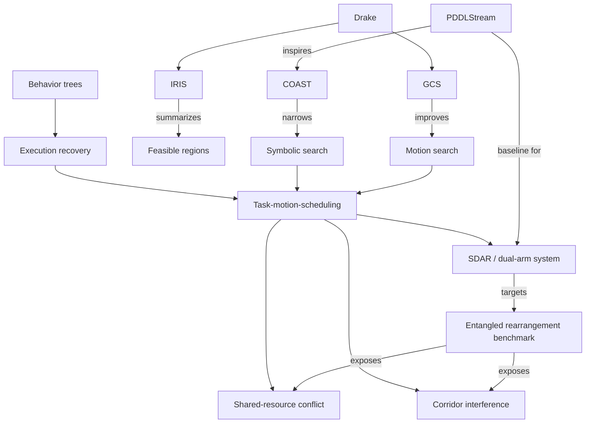

# Robotics TAMP knowledge graph design

Updated: 2026-06-07

## Diagnosis

Right now this repo is using KRAIL mostly as a **research-notes workspace** rather than a real **knowledge graph project**.

What is working:
- `rail search` over markdown notes
- repo-backed captures in `topics/inbox/`
- synthesis notes in `topics/notes/`
- source registry / research-plan scaffolding

What is missing:
- `.ontology/ontology.yaml` has no classes or properties yet
- `research_plan/state/entity_candidates.json` is empty
- `research_plan/state/sources.json` is empty
- `research_plan/state/claims.json` is empty
- `rail hydrate` fails because `.ontology/pipelines/project-default.yaml` does not exist
- `rail query classes` returns nothing useful because there is no populated graph

So the repo currently behaves like: **smart literature review with search**.
Not yet: **queryable robotics knowledge graph**.

## Current implementation update

As of 2026-06-07, the repo now has a practical middle layer:

- markdown frontmatter on core notes and captures
- optional `entity_metadata` typing in markdown
- `scripts/build_markdown_graph.js` as a lightweight mediator
- generated graph artifacts in `research_plan/graph/`
- GitHub Pages data copies in `docs/data/`

This is still not the full ontology path, but it is already much better than notes-only research mode.

## Why it feels too much like a research project

The active pack is `research-intelligence`, which is good for:
- papers
- claims
- evidence
- experiments
- synthesis

But Akash's use case needs more than that. It needs a system map that answers:
- which package implements which method?
- which benchmarks stress which failure modes?
- which stack is practical to run?
- where does scheduling sit relative to symbolic planning, motion planning, and execution?
- which topics connect to ARC / CUDA / path planning / dual-arm experiments?

That means the repo should shift from **paper-centric** to **stack-centric** and **entity-centric**.

## Better way to use RAIL/KRAIL here

Use KRAIL in 4 layers:

### 1. Capture layer
Keep using:
- `rail capture` for papers, GitHub repos, project pages, notes, emails

But every capture should be classified into one or more entity buckets:
- Paper
- Method
- Package
- Benchmark
- RobotSystem
- GeometryTechnique
- Scheduler
- ExecutionFramework
- FailureMode
- Experiment
- ResearchQuestion
- ProjectIdea

### 2. Ontology layer
The ontology should stop being empty and explicitly model robotics TAMP concepts.

Suggested core classes:
- Paper
- Method
- Package
- Benchmark
- TaskFamily
- RobotSystem
- Planner
- MotionPlanner
- Scheduler
- GeometryTechnique
- ExecutionFramework
- FailureMode
- Dataset
- Experiment
- Claim
- Limitation
- OpenProblem
- ProjectIdea
- ResearchGroup
- Person

Suggested relationships:
- `Paper INTRODUCES Method`
- `Paper EVALUATES_ON Benchmark`
- `Package IMPLEMENTS Method`
- `Package SUPPORTS Benchmark`
- `Method REQUIRES GeometryTechnique`
- `Method HANDLES FailureMode`
- `Method FAILS_ON FailureMode`
- `Benchmark EXPOSES FailureMode`
- `Benchmark BELONGS_TO TaskFamily`
- `Scheduler COORDINATES RobotSystem`
- `ExecutionFramework RECOVERS_FROM FailureMode`
- `Experiment TESTS Method`
- `Experiment USES Package`
- `ProjectIdea BUILDS_ON Package`
- `ProjectIdea TARGETS Benchmark`
- `ResearchGroup MAINTAINS Package`

### 3. Hydration / graph-building layer
Instead of only saving markdown notes, add a lightweight extraction pass that writes structured entity files from notes.

A good first version does not need full automation. It can start with hand-authored or semi-structured YAML/JSON records for:
- packages
- methods
- benchmarks
- papers
- failure modes

Then hydration can build a graph from those records.

### 4. Query / synthesis layer
Once entities exist, RAIL becomes much more useful:
- "show all packages related to dual-arm rearrangement"
- "which benchmarks expose shared-resource conflicts?"
- "what methods try to insert geometry checks early?"
- "which packages are practical for local experiments?"
- "what is the shortest path from PDDLStream to SDAR via scheduling ideas?"

## Topic expansion plan

The repo should cover more than the current foundation set.

### Core topics already present
- PDDLStream and descendants
- dual-arm rearrangement
- Drake / IRIS / GCS
- behavior trees / execution
- LLMs as interface or repair modules

### Topics to add next

#### A. Scheduling / resource reasoning
- temporal planning for manipulation
- shared-resource locking
- overlap / synchronization decisions
- task allocation across two arms
- feasibility-aware scheduling

#### B. Benchmark families
- assembly and insertion
- handoff / co-manipulation
- conveyor / streaming arrivals
- dense shelf or bin tasks
- clutter clearing with dependencies

#### C. Motion / geometry backends
- CuRobo / GPU motion planning
- OMPL / MoveIt connections
- Drake trajectory optimization
- grasp generation / IK libraries
- collision-checking acceleration

#### D. Execution / robustness
- behavior-tree runtimes
- replanning triggers
- failure recovery policies
- uncertainty / perception drift handling
- online repair vs full replan

#### E. System-building topics
- ROS 2 integration
- simulators (Isaac / PyBullet / Drake)
- logging / evaluation protocols
- hardware transfer constraints
- profiling and bottlenecks

#### F. Akash-specific strategy topics
- ARC-lab-relevant dual-arm experiments
- CUDA / GPU acceleration hooks
- practical reproducible student-scale setups
- publishable benchmark ideas
- portfolio-worthy project ideas

## Proposed graph view

## Recommended repo restructuring

### Keep
- `topics/inbox/`
- `topics/notes/`
- `research_plan/`
- `docs/`

### Add
- `entities/papers/`
- `entities/packages/`
- `entities/methods/`
- `entities/benchmarks/`
- `entities/failure_modes/`
- `entities/project_ideas/`
- `.ontology/pipelines/project-default.yaml`
- `.ontology/sources/*.yaml`
- `research_plan/graph/`

## High-leverage first implementation steps

1. Populate ontology classes and object properties in `.ontology/ontology.yaml`.
2. Create 10-20 seed entity records for:
   - PDDLStream
   - COAST
   - Fast Downward
   - Drake
   - IRIS
   - GCS
   - SDAR
   - dual-arm benchmark family
   - behavior trees
   - common failure modes
3. Add a minimal `project-default` hydration pipeline.
4. Generate a first graph artifact:
   - packages ↔ methods ↔ benchmarks ↔ failure modes
5. Update GitHub Pages to show:
   - topic map
   - package map
   - benchmark map
   - project ideas

## Best framing

This should become:
- not just a robotics reading repo
- not just a paper dump
- not just a research diary

It should become a **queryable robotics systems map** with:
- opinions
- evidence
- package comparisons
- benchmark coverage
- project ideas
- explicit graph structure
